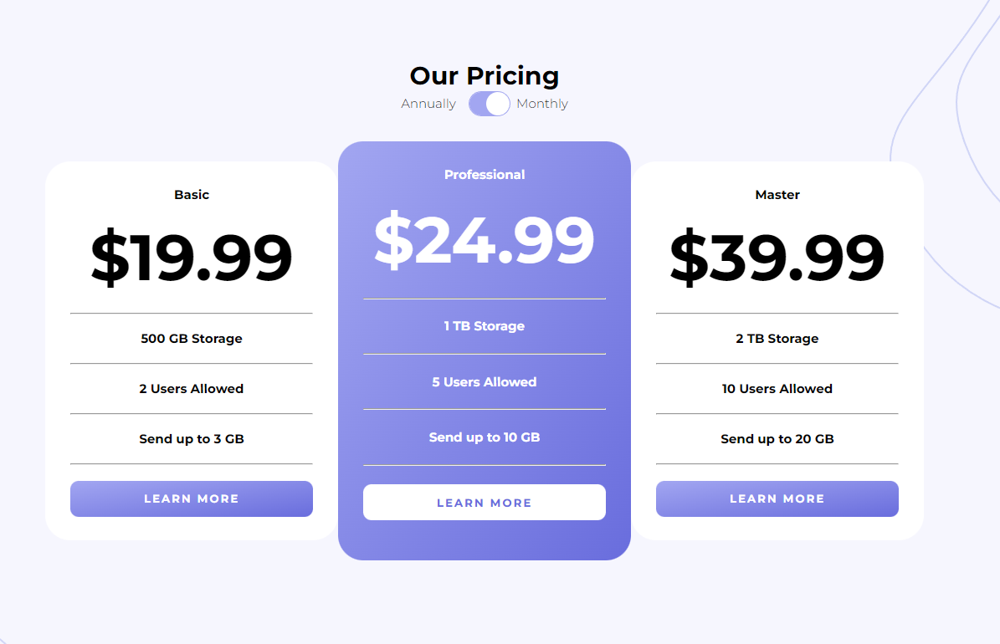

# Frontend Mentor - Pricing component with toggle solution

This is a solution to the [Pricing component with toggle challenge on Frontend Mentor](https://www.frontendmentor.io/challenges/pricing-component-with-toggle-8vPwRMIC). Frontend Mentor challenges help you improve your coding skills by building realistic projects. 

## Table of contents

- [Overview](#overview)
  - [The challenge](#the-challenge)
  - [Screenshot](#screenshot)
  - [Links](#links)
- [My process](#my-process)
  - [Built with](#built-with)
  - [What I learned](#what-i-learned)
  - [Useful resources](#useful-resources)
- [Author](#author)


## Overview

### The challenge

Users should be able to:

- View the optimal layout for the component depending on their device's screen size
- Control the toggle with both their mouse/trackpad and their keyboard
- **Bonus**: Complete the challenge with just HTML and CSS (Coming soon)

### Screenshot




### Links

- [Solution URL](https://www.frontendmentor.io/solutions/price-component-with-vanilla-js-V_M_2Bmxha)
- [Live Site URL](https://rickhalmoguera.github.io/Pricing-component/)

## My process

### Built with

- Semantic HTML5 markup
- CSS custom properties
- Flexbox
- Mobile-first workflow

### What I learned

In this project I practiced Event Listener, specifically the change one, which executes a function every time there is a change in the element that we indicate

To see how you can add code snippets, see below:


```js
const changePrice = ()=>{

    if( checkbox.checked){

        basicPriceDisplay.innerText = priceMonthly[0]
        proPriceDisplay.innerText = priceMonthly[1]
        masterPriceDisplay.innerText = priceMonthly[2]
    
    }else{
    
        basicPriceDisplay.innerText = priceAnnually[0]
        proPriceDisplay.innerText = priceAnnually[1]
        masterPriceDisplay.innerText = priceAnnually[2]
    }

}

checkbox.addEventListener("change", changePrice)
}
```

### Useful resources

- [onchange Event](https://www.w3schools.com/jsref/event_onchange.asp) - This helped me to use the EventListener of CHANGE

## Author

- Github - [Ricardo Halmoguera](https://github.com/RickHalmoguera)
- Frontend Mentor - [@RickHalmoguera](https://www.frontendmentor.io/profile/RickHalmoguera)

